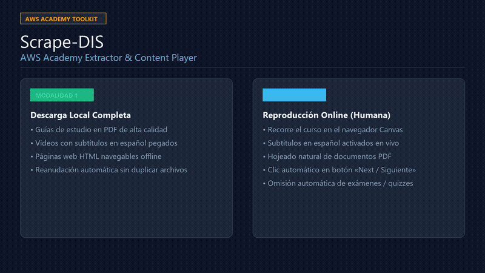

# Scrape-DIS (AWS Academy Extractor & Content Player)

> **Herramienta automatizada para estudiantes y docentes de AWS Academy sobre la plataforma Canvas LMS.**



🎬 **[Descargar / Ver Video Tutorial con Audio Explicativo (Voz en off IA)](assets/tutorial_video.mp4)** *(Duración: 1 min 25 s, formato MP4 ligero)*

---

## 💡 ¿Qué hace este programa?

Este sistema resuelve de forma automática dos necesidades esenciales al cursar en AWS Academy:

| Modalidad | ¿Para qué sirve? | ¿Qué hace en tu computadora? |
| :--- | :--- | :--- |
| **Opción 1: Descarga Estructurada** | Para tener todo el material de estudio sin conexión a internet. | Descarga las guías de estudio completas en PDF (todas las páginas renderizadas en alta resolución), baja los videos interactivos con subtítulos en español incrustados (vía FFmpeg) y guarda las lecturas HTML en carpetas ordenadas por módulo. |
| **Opción 2: Reproducción Humana Online** | Para recorrer el contenido directamente en Canvas sin saturar tu disco ni tu red. | Abre Chrome, espera a que carguen los reproductores interactivos (SCORM / Video.js), activa los subtítulos en español, respeta la duración completa de cada video, hojea los documentos PDF página a página y avanza de sección apretando el botón **«Next / Siguiente»** de Canvas, salteando automáticamente cuestionarios y exámenes. |

---

## ⚡ Guía Rápida en 3 Pasos (Sin tocar comandos)

Si estás en Windows y no quieres lidiar con consolas ni configuraciones técnicas, creamos tres archivos ejecutables para que lo pongas en marcha con un par de clics:

```text
📁 Scrape-DIS/
├── 1_instalar.bat      <-- Paso 1: Doble clic para instalar todo
├── 2_configurar.bat    <-- Paso 2: Doble clic para poner tu usuario y clave
└── 3_iniciar.bat       <-- Paso 3: Doble clic para arrancar el programa
```

### Paso 1: Instalar dependencias
1. Descargá o cloná este repositorio en tu computadora.
2. Hacé **doble clic en `1_instalar.bat`**.
   - El script verificará que tengas Python instalado.
   - Creará automáticamente el entorno virtual (`venv`).
   - Instalará todas las librerías necesarias (`Playwright`, `Pillow`, etc.).
   - Descargará el navegador Chromium para interactuar con Canvas.

> *Requisito:* Tener instalado [Python 3.10 o superior](https://www.python.org/downloads/) (marcando la casilla *"Add python.exe to PATH"*) y Google Chrome.

### Paso 2: Configurar tu acceso
1. Hacé **doble clic en `2_configurar.bat`**.
2. Se abrirá automáticamente el archivo de configuración `.env` en el **Bloc de Notas**:
   ```ini
   # 1. Ingresá tu usuario y contraseña de AWS Academy / Canvas:
   AWS_USER=tu_usuario_o_correo@ejemplo.com
   AWS_PASSWORD=tu_contraseña_aqui

   # 2. La URL de tu curso (por defecto configurado para IFTS29 - 2C2026):
   AWS_HOME_URL=https://awsacademy.instructure.com/courses/183094/modules
   ```
3. Guardá los cambios con `Ctrl + G` y cerrá el Bloc de Notas.

> [!NOTE]
> **Sobre el número de curso (`183094`):**
> Este número corresponde al curso **"AWS Academy Cloud Foundations para IFTS29 - 2C2026"**.  
> Si perteneces a otra comisión, curso o institución, entra a tu Canvas, ve a la sección **Módulos** y fíjate qué número figura en la barra de direcciones de tu navegador (`https://awsacademy.instructure.com/courses/<TU_NUMERO>/modules`). Si es distinto, cámbialo en la línea `AWS_HOME_URL` de tu `.env`.

### Paso 3: Iniciar el programa
1. Hacé **doble clic en `3_iniciar.bat`**.
2. Se abrirá la consola interactiva listando todos los módulos de tu curso.
3. ¡Listo! Elegí qué módulo querés procesar y qué acción realizar.

---

## 🖥️ Manual de Uso de la Consola

Al iniciar el programa verás una pantalla como esta:

```text
============================================================
              AWS Academy Material Extractor
============================================================

1. Módulo 1 - Información general sobre los conceptos de la nube
2. Módulo 2 - Aspectos económicos de la nube y facturación
3. Módulo 3 - Información general sobre la infraestructura global de AWS
4. Módulo 4 - Información general sobre la seguridad en la nube
...
Ingrese el número de módulo a procesar (o 'T' para todos, 'Q' para salir):
```

### ¿Qué opción elegir?

1. **Ingresá el número del módulo** (por ejemplo `3`) o escribí `T` para procesar todo el curso completo de forma secuencial.
2. A continuación, el sistema te preguntará qué acción querés realizar:
   * **Opción [1] Descargar módulo:**
     - Analiza todos los ítems del módulo.
     - Descarga videos con subtítulos pegados, PDFs completos y lecturas HTML en la carpeta `descargas_aws/`.
     - Si cancelás o se interrumpe, podés volver a ejecutarlo: gracias a su **reanudación inteligente**, nunca vuelve a descargar lo que ya tenías guardado.
   * **Opción [2] Reproducir contenido (Online / Humano):**
     - Abre una ventana visible de Google Chrome.
     - Recorre cada ítem respetando tiempos de lectura realistas.
     - En los videos: detecta el reproductor interactivo SCORM/Video.js, activa los subtítulos en español y espera a que termine.
     - En las guías PDF: aguarda a que el visor cargue las páginas (ej. 44 páginas de la Student Guide) y realiza un hojeado progresivo.
     - Al concluir cada lección, presiona el botón nativo **«Next / Siguiente»** del pie de página de Canvas.
     - **Salta automáticamente los exámenes y cuestionarios** (quizzes/assignments) para que no haya riesgo de resolverlos accidentalmente.

---

## 💻 Instalación Avanzada (Para usuarios de Terminal / Git)

Si prefieres trabajar desde la línea de comandos (PowerShell, Bash o CMD):

```bash
# 1. Clonar el repositorio
git clone https://github.com/GuiLeCha/Scrape-DIS.git
cd Scrape-DIS

# 2. Crear y activar entorno virtual
python -m venv venv
.\venv\Scripts\activate.bat   # En CMD
.\venv\Scripts\Activate.ps1  # En PowerShell

# 3. Instalar dependencias y navegador
pip install -r requirements.txt
playwright install chromium

# 4. Crear archivo de configuración
copy .env.example .env
# (Edita .env con tus credenciales)

# 5. Ejecutar
python aws_academy_extractor.py
```

---

## 🛠️ Preguntas Frecuentes y Solución de Problemas

#### 1. ¿Qué pasa si mi cuenta me pide código por SMS o app (2FA / MFA)?
El navegador Chrome se abre visible en tu pantalla. La primera vez que te pida el código de verificación, ingrésalo normalmente a mano. La sesión quedará guardada en tu carpeta de perfil (`PROFILE_DIR`), de modo que las siguientes veces entrará directo sin pedir autenticación.

#### 2. Mensaje de error sobre "SingletonLock" o "Perfil en uso"
Si cerraste la consola de golpe con la 'X' mientras el navegador estaba abierto, puede quedar bloqueado el archivo de sesión. El programa intenta desbloquearlo automáticamente, pero si persiste, asegúrate de cerrar todas las ventanas de Chrome y elimina la carpeta `.aws_chrome_profile` o el archivo `SingletonLock` que haya dentro.

#### 3. ¿Cómo instalo FFmpeg si no lo tengo?
FFmpeg solo es necesario si eliges **descargar videos** y querés que les pegue los subtítulos en español. En Windows 10/11 podés instalarlo en un segundo abriendo una consola y ejecutando:
```powershell
winget install Gyan.FFmpeg
```
O descargando el binario desde [gyan.dev/ffmpeg/builds](https://www.gyan.dev/ffmpeg/builds/) y configurando la ruta en `FFMPEG_PATH` dentro de tu `.env`.

#### 4. ¿Cómo pausar o detener la ejecución?
En cualquier momento puedes presionar `Ctrl + C` en la ventana de consola. El programa cerrará el navegador de forma ordenada sin dañar ningún archivo ni perfil.

---

## 📁 Estructura del Repositorio

```text
Scrape-DIS/
├── 1_instalar.bat                # Instalador automático en 1 clic
├── 2_configurar.bat              # Asistente de configuración de .env
├── 3_iniciar.bat                 # Lanzador del programa
├── aws_academy_extractor.py      # Punto de entrada en Python
├── requirements.txt              # Librerías de Python requeridas
├── .env.example                  # Plantilla documentada de variables
├── README.md                     # Este manual de usuario
├── assets/                       # Material audiovisual
│   ├── demo.gif                  # Demostración animada
│   └── tutorial_video.mp4        # Video explicativo completo con voz IA
└── aws_extractor/                # Código fuente modular
    ├── config.py                 # Gestor de configuración y .env
    ├── core/
    │   ├── discovery.py          # Detección de módulos y omisión de exámenes
    │   ├── extractor.py          # Motor de descargas
    │   ├── login.py              # Login automático con credenciales
    │   └── player.py             # Reproductor online con ritmo humano
    ├── extractors/               # Extractores específicos (PDF, Video, HTML)
    ├── media/                    # FFmpeg, subtítulos y ensamblado PDF
    └── ui/                       # Interfaz de consola interactiva
```

---

## 📄 Licencia
Proyecto desarrollado con fines educativos y de respaldo personal de material de estudio para estudiantes de **IFTS 29**.
